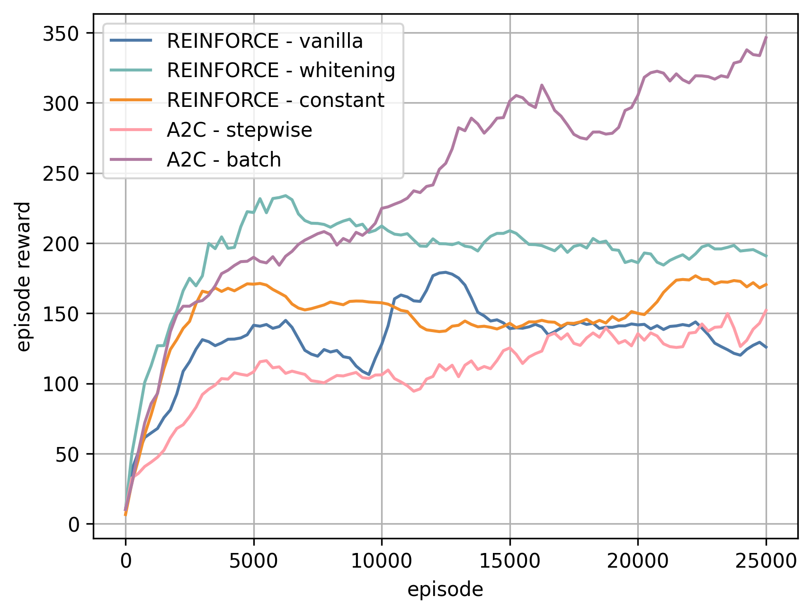

# Domain Randomization in Robotic Control

##### by Francesco Giuseppe Gillio, in collaboration with Yasaman Golshan and Sara Asadi.
###### Department of Control and Computer Science
###### Polytechnic University of Turin

## Table of Contents

- [Abstract](#report-abstract)
- [Environment](#environment)
- [Requirements](#requirements)
- [Algorithms](#algorithms)
  - [REINFORCE](#reinforce)
  - [A2C](#a2c)
  - [PPO](#ppo)
  - [Hyperparameters Tuning](#hyperparameters-tuning)
- [Uniform Domain Randomization](#uniform-domain-randomization)
- [Domain Randomization Optimization IDentification](#domain-randomization-optimization-identification)
- [Example of Training](#example-of-training)

## Abstract

This research aims to explore reinforcement learning (RL) agents within the Gym Hopper environment with the MuJoCo physics engine for accurate modeling. The Hopper, a one-legged robot, must learn and master hopping and maintaining balance while optimizing horizontal speed. Nowadays, the effective application of reinforcement learning to robotics represents a significant challenge, mainly due to the complexities of learning in real-world environments and accurately simulating physics. To address these challenges, this study investigates a range of policy gradient algorithms, including REINFORCE, Actor-Critic, and Proximal Policy Optimization (PPO), assessing their strengths and suitability for training agents in simulation environments. Furthermore, the project delves into state-of-the-art techniques for Domain Randomization, in particular Domain Randomization Optimization IDentification (DROID), which enhances the robustness and transferability of learned policies across various conditions. Through the application of these methodologies, this research aims to mitigate the "reality gap" often found in robotic applications, thereby improving agent performance and adaptability. This research not only contributes to the understanding of effective RL strategies in robotics but also lays the groundwork for future explorations into the refinement of domain randomization techniques, pushing the boundaries of practical and reliable robotic systems in real-world scenarios.

## Environment


The [Hopper](https://www.gymlibrary.ml/environments/mujoco/hopper/) of MuJoCo, a two-dimensional figure with one leg, comprises four primary body parts: a top `torso`, a middle `thigh`, a bottom `leg`, and a single `foot` supporting the entire body. The objective involves generating forward (rightward) movement through torque application at the three hinges connecting these body segments.
In this study, we implemented two customized versions of the Gym Hopper environment: `CustomHopper-source-v0` and `CustomHopper-target-v0`. The main distinction between these environments concerns the mass of the Hopper's `torso`. Specifically, `CustomHopper-source-v0` sets the `torso` mass at `2.53429174` kg, while `CustomHopper-target-v0` raises it to `3.53429174` kg. 

The transition from the source to the target environment embodies the essence of sim-to-real transferability. This project aims to create algorithms capable of learning within simulation environments (`source`) and successfully applying acquired knowledge in real-world situations (`target`).

## Requirements

- [mujoco-py](https://github.com/openai/mujoco-py)
- [stable-baselines3](https://github.com/DLR-RM/stable-baselines3)

#### Setup for Google Colab

Clone the repository and install the Hopper environment system requirements by running the following commands:

```python
!git clone https://github.com/305909/reinforce.git
!bash reinforce/src/requirements.sh
```

## Algorithms

This repository contains several implementations of RL algorithms, differing in control policies, learning strategies and domain randomization.

### REINFORCE

This project implements the REINFORCE (Monte-Carlo Policy Gradient) algorithm with three variations that differ for the usage of the baseline term:
1. without baseline
2. with constant baseline `baseline = 20`
3. whitening transformation baseline

For more details, check out our custom implementation of the REINFORCE (Monte-Carlo Policy Gradient) algorithm in the `mc.py` file inside the `src/agents` folder.

#### How to run the code on Google Colab

Train and test the REINFORCE (Monte-Carlo Policy Gradient) algorithm by running the following command:

```python
# set output path directory
OUTPUT = 'results'

# run REINFORCE (Monte-Carlo Policy Gradient) algorithm
!python /content/reinforce/src/train/MCP-train.py \
        --train \
        --test \
        --render \
        --device cuda \
        --train-env source \
        --test-env target \
        --train-episodes 10000 \
        --test-episodes 50 \
        --eval-frequency 100 \
        --learning-rate 2.5e-4 \
        --baseline whitening \
        --directory {OUTPUT}
```
The `MCP-train.py` code offers the chance to set the pre-trained input model (in .mdl format) via the execution parameter `--input-model`. 

For more details, check out the available execution parameters by passing the `--help` argument.

### A2C

This project implements the A2C (Advantage-Actor-Critic) algorithm with two variations that differ for the update method of the policy network:
1. `stepwise` fashion (`batch-size 1`)
2. `batch` fashion (`batch-size N, with N > 1`)

For more details, check out our custom implementation of the Advantage-Actor-Critic algorithm in the `ac.py` file inside the `src/agents` folder.

#### How to run the code on Google Colab

Train and test the A2C algorithm by running the following command:

```python
# set output path directory
OUTPUT = 'results'

# run A2C (Advantage-Actor-Critic) algorithm
!python /content/reinforce/src/train/A2C-train.py \
        --train \
        --test \
        --render \
        --device cuda \
        --train-env source \
        --test-env target \
        --train-episodes 10000 \
        --test-episodes 50 \
        --eval-frequency 100 \
        --learning-rate 2.5e-4 \
        --batch-size 32 \
        --directory {OUTPUT}
```

The `A2C-train.py` code offers the chance to set the pre-trained input model (in .mdl format) via the execution parameter `--input-model`. 

For more details, check out the available execution parameters by passing the `--help` argument.

### PPO

This project implements the PPO (Proximal Policy Optimization) algorithm using the open-source reinforcement learning library [stable-baselines3](https://github.com/DLR-RM/stable-baselines3).

#### How to run the code on Google Colab

Train and test the PPO algorithm by running the following command:

```python
# set output path directory
OUTPUT = 'results'

# run PPO (Proximal-Policy-Optimization) algorithm
!python /content/reinforce/src/train/PPO-train.py \
        --train \
        --test \
        --render \
        --device cuda \
        --train-env source \
        --test-env target \
        --train-episodes 10000 \
        --test-episodes 50 \
        --eval-frequency 100 \
        --learning-rate 2.5e-4 \
        --directory {OUTPUT}
```

The `PPO-train.py` code offers the chance to set the pre-trained input model (in .mdl format) via the execution parameter `--input-model`. 

For more details, check out the available execution parameters by passing the `--help` argument.

### Hyperparameters Tuning

This project also implements parameter tuning for the algorithms under investigation. The `src/fine-tune` folder contains the fine-tuning code for each algorithm:

- `MCP-fine-tune.py`: code to fine-tune the `REINFORCE` parameters;
- `A2C-fine-tune.py`: code to fine-tune the `A2C` parameters;
- `PPO-fine-tune.py`: code to fine-tune the `PPO` parameters;

#### How to run the code on Google Colab

Search for the optimal parameter configuration for each algorithm by running the following commands:

```python
# run gridsearch algorithm for the REINFORCE model
!python /content/reinforce/src/fine-tune/MCP-fine-tune.py \
        --train-episodes 10000 \
        --test-episodes 100 \
        --device 'cuda'
```
```python
# run gridsearch algorithm for the A2C model
!python /content/reinforce/src/fine-tune/A2C-fine-tune.py \
        --train-episodes 10000 \
        --test-episodes 100 \
        --device 'cuda'
```
```python
# run gridsearch algorithm for the PPO model
!python /content/reinforce/src/fine-tune/PPO-fine-tune.py \
        --train-episodes 10000 \
        --test-episodes 100 \
        --device 'cuda'
```

## Uniform Domain Randomization

This project implements a `CustomHopper-source-UDR-v0` custom environment to introduce Uniform Domain Randomization (UDR). UDR involves varying the link masses of the Hopper robot during training, while maintaining the torso mass constant, to expose the agent to a range of dynamic conditions. For more details, check out our custom implementation of the `CustomHopper-source-UDR-v0` environment in the `hopper.py` file inside the `src/env` folder.

#### How to run the code on Google Colab

To enable Uniform Domain Randomization, set the custom environment `CustomHopper-source-UDR-v0` as testing environment, i.e. the execution parameter `test-env` to `'source-UDR'`. Train and test the PPO algorithm with UDR by running the following command:

```python
# set output path directory
OUTPUT = 'results'

# run PPO (Proximal-Policy-Optimization) algorithm with UDR
!python /content/reinforce/src/train/PPO-train.py \
        --train \
        --test \
        --render \
        --device cuda \
        --train-env source-UDR \
        --test-env target \
        --train-episodes 10000 \
        --test-episodes 50 \
        --eval-frequency 100 \
        --learning-rate 2.5e-4 \
        --directory {OUTPUT}
```

For more details, check out the available execution parameters by passing the `--help` argument.

## Domain Randomization Optimization IDentification

This project explores Domain Randomization Optimization IDentification (DROID), an advanced approach in reinforcement learning aimed at refining simulation environments to enhance the robustness and transferability of learned policies. In contrast to traditional uniform domain randomization (UDR), which introduces broad stochastic variations to simulation parameters uniformly, DROID focuses on iteratively adjusting these parameters to closely approximate real-world dynamics.

#### How to run the code on Google Colab

Train and test the DROID algorithm by running the following command:

```python
# set output path directory
OUTPUT = 'results'

# run DROID (Domain Randomization Optimization IDentification) algorithm
!python /content/reinforce/src/train/DROID-train.py \
        --train \
        --test \
        --render \
        --device cuda \
        --train-episodes 10000 \
        --test-episodes 50 \
        --eval-frequency 100 \
        --learning-rate 2.5e-4 \
        --optimization-rate 2.5e-5 \
        --dist uniform \
        --directory {OUTPUT}
```

The `DROID-train.py` code offers the chance to set the pre-trained input model (in .mdl format) via the execution parameter `--input-model`. 

For more details, check out the available execution parameters by passing the `--help` argument.

## Example of Training

Extract of monitoring during training for performance comparison of different algorithms.

<div style="display: flex; justify-content: space-between;">
    
    
</div>
